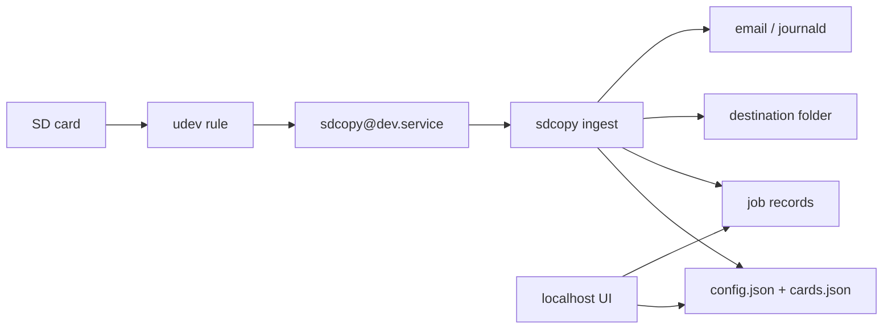

# sdcopy modernization plan

This plan covers two things: making ingest reliable enough to run unattended, and adding a simple localhost UI so new cards can be onboarded and behavior can be changed without editing scripts.

The photography workflow stays the same. Insert a known card, files land in a readable dated folder, a summary is saved, an email goes out, the card unmounts when it is safe.

## Goals

- Stop copying the wrong disk, writing to an unmounted destination, or reporting success after a failed transfer.
- Identify cards by filesystem UUID and only auto-ingest cards that have been onboarded.
- Let someone on the NAS open a local page to name a new card, set destination/naming, and toggle behavior.
- Keep the machine headless. The UI is for setup and status, not a required step on every insert.

## Non-goals (v1)

- Remote access, accounts, or a public website.
- Photo editing, RAW conversion, or gallery browsing.
- Multi-host or Docker packaging.
- Deleting files from the card after copy.
- A JavaScript SPA or extra Node toolchain.

## Current problems this plan absorbs

| Area | What is wrong today | What replaces it |
| --- | --- | --- |
| Trigger | `udev` `KERNEL=="sd[a-z][0-9]"` fires on any SCSI/USB partition; service is also `WantedBy=multi-user.target` | USB/MMC partition rule starts `sdcopy@%i.service` only; unit is not enabled at boot |
| Process model | `Type=simple` + `nohup` background script; systemd can kill the copy | `Type=oneshot`, `TimeoutStartSec=infinity`, ingest runs in the service cgroup |
| Mount wait | 10s `find` of the first dir under `/media/nas` | Wait on `findmnt -S /dev/%i` for the udev device |
| Destination | `mkdir -p` under `/mnt/<uuid>/...` even if that volume is missing | Refuse to start unless the destination root is an actual mount |
| Transfer | `rsync -av` with no exit-code check; always emails success; then unmounts | FAT-aware rsync, verify, unmount only on success |
| Identity | Folder name from mount label + 12-hour time without seconds | UUID-keyed card registry; `{nickname}_{YYYYMMDD}_{HHMMSS}` |
| Code | Dead `copysd.sh`, broken `a#!/bin/bash` shebang, CRLF, UTF-16 README, placeholder paths | One Python package, UTF-8 LF files, installable units |
| Safety | Unknown USB disks are ingested | Unknown cards are held for onboarding |

## Target architecture



Three long-lived pieces:

1. **udev rule** — only announces that a removable partition appeared.
2. **ingest worker** — systemd oneshot that decides hold vs copy, then rsyncs.
3. **web UI** — localhost app for onboarding, settings, and job status.

udev never copies files. The UI never talks to udev directly. Both the worker and the UI read/write the same config and job files.

### Why Python for ingest and UI

The current bash split exists to outrun udev timeouts. systemd oneshot already solves that. One Python 3 package gives a shared card registry, job records, and settings without a second config parser. rsync, `findmnt`, and `udisksctl` stay as subprocesses. No compile step on the NAS.

Suggested runtime: Python 3.11+ from the distro, venv with FastAPI, Jinja2, uvicorn. Ingest can run as `python -m sdcopy.ingest sda1` with only the stdlib plus the shared package; web extras stay in the venv.

### Privilege split

| Process | User | Why |
| --- | --- | --- |
| udev rule / systemd unit files | root (install once) | udev cannot be user-owned |
| `sdcopy@.service` | `nas` (or configured user) | Matches udisks mounts under `/media/nas` or `/run/media/nas` |
| `sdcopy-web.service` | same user | Can edit config; bind `127.0.0.1` |
| Unmount | that user via `udisksctl` | Avoid a root copy daemon |

Do not run the UI as root. Destination paths the UI accepts must stay under a configured allowed root.

## Data model

All state lives on disk so a reboot does not depend on the UI process.

### `config.json` (global settings)

```json
{
  "destination_root": "/mnt/photos/PhotoLandingZone",
  "require_destination_mount": true,
  "naming_template": "{nickname}_{date}_{time}",
  "unknown_card_policy": "hold",
  "auto_unmount": true,
  "verify_checksum": true,
  "source_mode": "entire_card",
  "owner": "nas",
  "group": "sdcopy",
  "dir_mode": "2775",
  "file_mode": "0664",
  "email": {
    "enabled": true,
    "to": "",
    "msmtp_account": "default"
  },
  "listen": {
    "host": "127.0.0.1",
    "port": 8743
  },
  "mount_wait_seconds": 60,
  "log_dir": "/var/log/sdcopy"
}
```

`unknown_card_policy` is `hold` (default) or `copy`. `hold` is the reliability default: a random USB disk will not be ingested.

`source_mode` is `entire_card` or `dcim_only`.

### `cards.json` (onboarded cards)

Primary key is the filesystem UUID from `lsblk -no UUID /dev/sdX1` (or `mmcblk0p1`). That identifies the **card**, not the USB reader.

```json
{
  "cards": [
    {
      "uuid": "A1B2-C3D4",
      "nickname": "Sony A7 main",
      "label": "SONY",
      "enabled": true,
      "destination_root": null,
      "naming_template": null,
      "auto_unmount": null,
      "source_mode": null,
      "notes": ""
    }
  ]
}
```

`null` on a per-card field means “use global config.” Reformat of the card changes UUID; that is treated as a new card and must be onboarded again.

### Job records

One JSON file per run under `/var/lib/sdcopy/jobs/`, plus a small `jobs.sqlite` index if querying gets painful. v1 can be JSON-only:

- `id`, `started_at`, `finished_at`
- `device`, `uuid`, `nickname`
- `status`: `running` | `success` | `failed` | `held` | `safe_to_remove` | `unmount_failed`
- `src`, `dest`, `bytes`, `file_count`, `rsync_exit`
- `summary_path`, `error`

The UI lists these. Email body is generated from the same record.

### Paths

Prefer a single state root that the `nas` user owns:

- Config: `/etc/sdcopy/config.json` (install default) overlayed by `/var/lib/sdcopy/config.json` (UI edits)
- Cards: `/var/lib/sdcopy/cards.json`
- Jobs: `/var/lib/sdcopy/jobs/`
- Logs: journald always; optional file under `log_dir`

UI writes never go to `/etc` if `/var/lib/sdcopy/config.json` exists. That keeps package/unit files immutable after install.

## File layout after the rewrite

```
sdcopy/
  sdcopy/
    __init__.py
    config.py          # load/save/merge settings + cards
    device.py          # lsblk/findmnt/udev device facts
    ingest.py          # oneshot entrypoint
    rsync.py           # build argv, run, interpret exit codes
    notify.py          # msmtp + journald
    jobs.py            # job records
    web/
      app.py           # FastAPI
      templates/       # dashboard, cards, settings, job
      static/          # small CSS, no framework build
  systemd/
    sdcopy@.service
    sdcopy-web.service
  udev/
    99-sdcopy.rules
  sdcopy.conf.example
  install.sh
  README.md            # rewrite as UTF-8 LF
  PLAN.md              # this file
```

Remove after the replacements work: `copysd.sh`, `preliminaryscript.sh`, `background.sh`, `sdcard-copy.service`, `udev rule.txt`.

## Phase 1 — Foundation

Repo and shared library only. No behavior change on a live NAS until later phases are installed.

- Convert everything to UTF-8, LF line endings.
- Rewrite README in UTF-8: what it does, how it is triggered, how to install, how to open the UI.
- Add `sdcopy.config` load/save with the schema above and example config.
- Add `sdcopy.device`: given `sda1` / `mmcblk0p1`, return kernel name, UUID, label, fstype, size, mountpoint (`findmnt`), whether it is a mount.
- Add path templating: `{nickname}`, `{label}`, `{uuid}`, `{date}` (`YYYYMMDD`), `{time}` (`HHMMSS`).
- Add pytest for UUID lookup, template rendering, “destination is a mount” checks, and merge of per-card overrides.
- `install.sh` sketch: venv, unit files, udev rule, state dirs, `systemctl daemon-reload`. Do not `enable` `sdcopy@.service` for `multi-user.target`.

**Done when:** tests pass on a machine with no SD hardware; `python -m sdcopy.device sda1` prints facts or a clear “not present.”

## Phase 2 — Reliable ingest

Replace the udev/systemd/bash chain. Still no UI. Unknown cards follow `unknown_card_policy` (default hold, which looks like a no-op plus a job record).

### udev

```
ACTION=="add", SUBSYSTEM=="block", ENV{DEVTYPE}=="partition", \
  ENV{ID_BUS}=="usb", ENV{ID_FS_TYPE}=="vfat|exfat|ntfs", \
  TAG+="systemd", ENV{SYSTEMD_WANTS}+="sdcopy@%k.service"

ACTION=="add", SUBSYSTEM=="block", KERNEL=="mmcblk[0-9]p[0-9]", \
  ENV{ID_FS_TYPE}=="vfat|exfat|ntfs", \
  TAG+="systemd", ENV{SYSTEMD_WANTS}+="sdcopy@%k.service"
```

If this NAS has other USB disks that should never ingest, add `ATTRS{idVendor}` / `ATTRS{idProduct}` for the card reader. Document that pin in README.

### systemd unit

```ini
[Unit]
Description=Ingest removable volume %i
BindsTo=dev-%i.device
After=dev-%i.device

[Service]
Type=oneshot
TimeoutStartSec=infinity
Nice=10
IOSchedulingClass=idle
User=nas
Group=sdcopy
ExecStart=/usr/local/lib/sdcopy/venv/bin/python -m sdcopy.ingest %i
```

No `[Install]` / `WantedBy=multi-user.target`. Activation is udev only.

### Worker sequence

1. `flock` `/var/lib/sdcopy/sdcopy.lock` so two partitions do not interleave.
2. Wait up to `mount_wait_seconds` for `findmnt -n -S /dev/%i`.
3. Read UUID/label/fstype. If no UUID, record `held`/`failed` and stop (cannot onboard safely).
4. If `require_destination_mount` and destination root is not a mount, fail (do not `mkdir -p` onto the OS disk).
5. Look up UUID in `cards.json`.
   - Unknown + `hold`: write a `held` job, optional email “new card, open the UI,” exit 0.
   - Unknown + `copy`: ingest with label as nickname.
   - Known + `enabled: false`: skip, job `held`.
6. Build dest dir from template. Collision: append `_2`, `_3`, never overwrite.
7. rsync:
   - FAT/exFAT: `-rt --modify-window=1`
   - `--partial --partial-dir=.rsync-partial`
   - `--info=stats2`
   - `--checksum` when `verify_checksum` is true
   - exclude `System Volume Information`, `.Trash*`
8. Treat rsync exit `0` as success. Exit `24` (vanished source files) is success-with-warning. Anything else fails; **do not unmount**.
9. Optional second `--checksum --dry-run` when verification is on; any remaining files fail the job.
10. `chown`/`chmod` dest; failure fails the job.
11. Write `transfer_summary.txt` into the dest folder (keep today’s photography-friendly artifact).
12. `sync`. If auto-unmount: `udisksctl unmount -b /dev/%i`, then try eject. Success → `safe_to_remove`. Unmount failure → `unmount_failed` and say so in email.
13. Notify from the job record. Never send “completed successfully” unless status is `success` or `safe_to_remove`.

### Logging

- stdout/stderr go to journald (`journalctl -u sdcopy@sda1.service`).
- Append a short line to `log_dir/sdcopy.log`.
- Do not dump `env` and do not overwrite the log file.

**Done when:** inserting a known-UUID fixture (or a real card with a hand-written `cards.json`) copies into a new folder, writes a job record, and unmounts only after rsync exit 0. Pulling the card mid-copy emails failure and leaves the dest folder in place.

## Phase 3 — Card registry CLI

Thin CLI on the same library the UI will call. This is the onboarding backend.

```
sdcopy devices              # currently inserted partitions + UUID/label/known?
sdcopy cards                # registry
sdcopy onboard UUID --nickname "Sony A7 main"
sdcopy card UUID --disable
sdcopy settings             # show
sdcopy settings set destination_root /mnt/photos/PhotoLandingZone
sdcopy jobs                 # recent
sdcopy ingest sda1 --dry-run
```

`--dry-run` prints planned dest and rsync argv without copying.

**Done when:** a card can be onboarded over SSH with no web server running, and the next insert uses that nickname and destination.

## Phase 4 — Localhost UI

Simple server-rendered pages. No build step. Poll every 2s on the dashboard; no websocket in v1.

Bind `127.0.0.1:8743` by default (`http://127.0.0.1:8743`). Opening it on the NAS desktop or via SSH tunnel is enough. Do not listen on `0.0.0.0` unless the operator later changes config; if they do, require a shared token header/cookie before that bind is allowed.

### Screens

1. **Dashboard**
   - Inserted devices now: nickname or “not onboarded,” size, mount, job in progress.
   - Held cards with an **Onboard** button.
   - Last ~20 jobs with status (`safe to remove` vs `leave the card in`).
   - Link to logs / job detail.

2. **Onboard wizard** (the main new UX)
   - Pick a currently inserted unknown device (or the held job that brought you here).
   - Show UUID, label, filesystem, size. Do not require the operator to know udev names.
   - Form: nickname (required), destination override, naming template, auto-unmount, source mode, notes.
   - Optional **Dry run** (lists dest + file count).
   - **Save** writes `cards.json`.
   - **Save and copy now** writes the card then starts ingest for that device (`systemd-run` or direct `sdcopy.ingest`, same flock).

3. **Cards**
   - List, edit, enable/disable, forget.
   - Forget does not delete already copied folders.

4. **Settings**
   - All global `config.json` fields: destination root, unknown-card policy, verify, email, unmount, listen address, wait timeout, ownership.
   - Validate destination root is an existing directory and, if required, a mountpoint, before save.

5. **Job detail**
   - Status, dest path, rsync stats, error, link to `transfer_summary.txt` if still on disk.

### Implementation notes

- FastAPI + Jinja2 + one CSS file. Forms POST to the server; progressive enhancement, not an API-only SPA.
- JSON endpoints under `/api/*` are fine for the dashboard poll (`GET /api/status`).
- Writes use the same functions as the CLI so behavior cannot drift.
- CSRF is low-risk on localhost; still use POST for mutations and same-origin forms.
- Path safety: reject destinations outside `destination_root`’s allowed parent list (start with a single allowed root).

### systemd web unit

```ini
[Unit]
Description=sdcopy local setup UI
After=network.target

[Service]
User=nas
Group=sdcopy
WorkingDirectory=/var/lib/sdcopy
ExecStart=/usr/local/lib/sdcopy/venv/bin/uvicorn sdcopy.web.app:app --host 127.0.0.1 --port 8743
Restart=on-failure

[Install]
WantedBy=default.target
```

This unit *is* enabled so the UI is available without an SD card inserted.

**Done when:** insert a never-seen card → dashboard shows it as held → wizard saves a nickname → copy now → job shows `safe to remove` → settings change (for example auto-unmount off) is honored on the next insert.

## Phase 5 — Install docs and cleanup

- `install.sh` copies units and udev rules, creates `/var/lib/sdcopy`, installs the venv, reloads udev/systemd, enables `sdcopy-web.service` only.
- README: install, open UI, onboard first card, pin udev to a reader if needed, email/msmtp, troubleshooting (`journalctl`, held jobs, destination not mounted).
- Delete obsolete bash/service/udev-text files.
- Keep email via msmtp as today; include rsync stats and dest path in the body. Failures and “held for onboarding” are different subjects.

**Done when:** a clean install on Ubuntu-like systemd can go from clone → install → open UI → onboard → ingest without editing unit files by hand.

## UI and reliability mapping

| Review item | Phase | How the UI participates |
| --- | --- | --- |
| Instantiated oneshot, no nohup | 2 | UI starts copies through the same ingest entrypoint |
| Tight udev match | 2 | UI does not broaden udev; it only names UUIDs that already appeared |
| rsync exit / no false success | 2 | Dashboard shows real job status |
| `findmnt` on the udev device | 2 | Device list uses the same helper |
| Destination must be mounted | 2 + 4 | Settings save rejects a non-mount if required |
| Card UUID registry | 3 + 4 | Onboarding wizard is the friendly writer |
| flock / unique dest names | 2 | Copy now and udev share the lock |
| Safe unmount + messaging | 2 + 4 | Dashboard copy for `safe_to_remove` / `unmount_failed` |
| CRLF / shebang / UTF-16 | 1 | Hygiene before new code |
| Drop `copysd.sh` | 5 | After worker+UI replace it |

## Risks

- **USB SD readers often expose the reader serial, not the card CID.** Filesystem UUID is the right v1 identity. Document that a reformat requires re-onboarding.
- **Multi-partition cards** can start two units. flock serializes them; each partition has its own UUID. Onboard the photo partition (usually the exFAT/vfat one). The udev fstype filter should ignore EFI/system partitions.
- **udisks mount path** varies (`/media/nas/LABEL` vs `/run/media/nas/LABEL`). Always use `findmnt` by device, never “first directory under /media/nas.”
- **Checksum verify** on a huge card is slow. Default on for photography; settings toggle for people who want speed.
- **Listening beyond localhost** would expose dest-path writes. v1 refuses `0.0.0.0` unless a token is set.

## Implementation order

Build in phase order. Phase 4 must not invent a second settings format. If something has to slip, ship Phases 1–3 (reliable ingest + CLI onboarding) before the UI; the UI is then only templates over existing commands.

Do not enable auto-copy of unknown cards to “make the UI optional.” The UI (or CLI) is how a card becomes trusted. That is the safety model.
